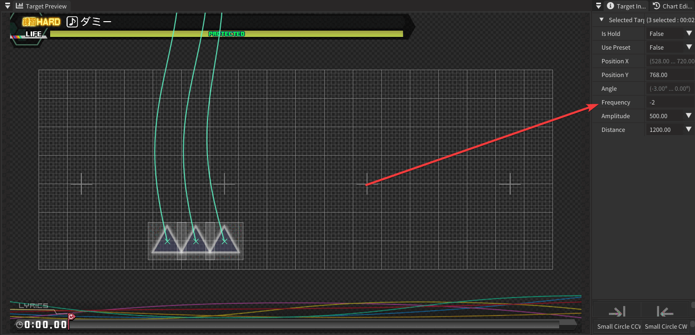
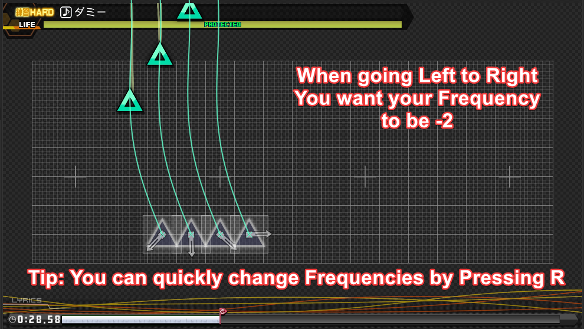
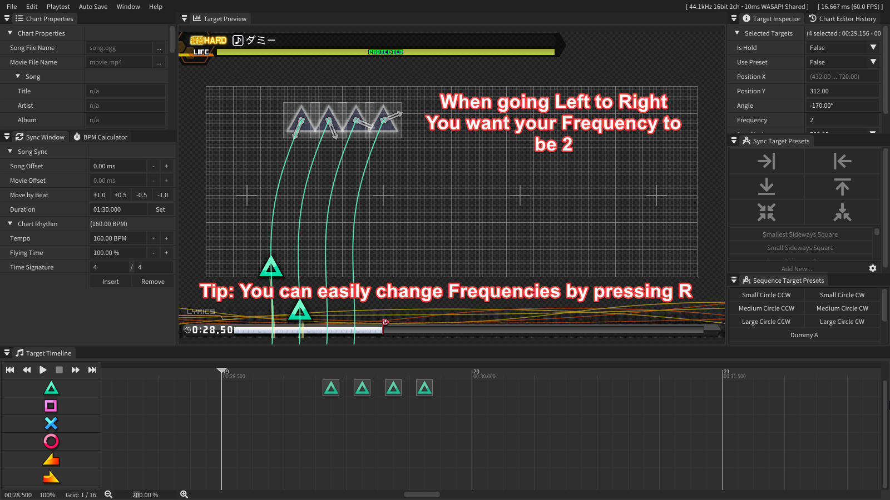
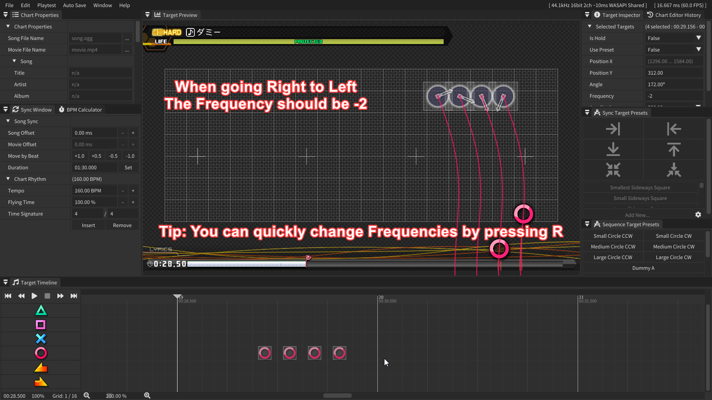
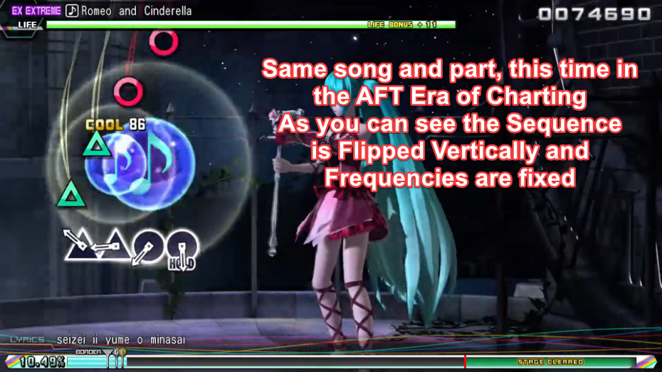
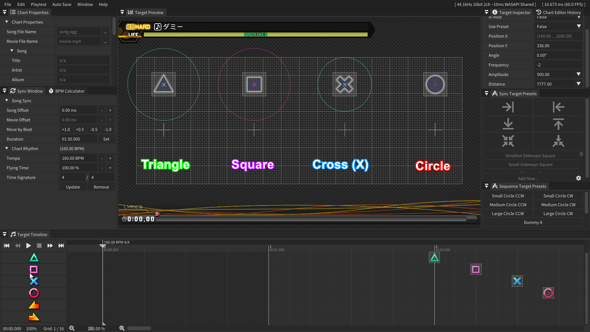
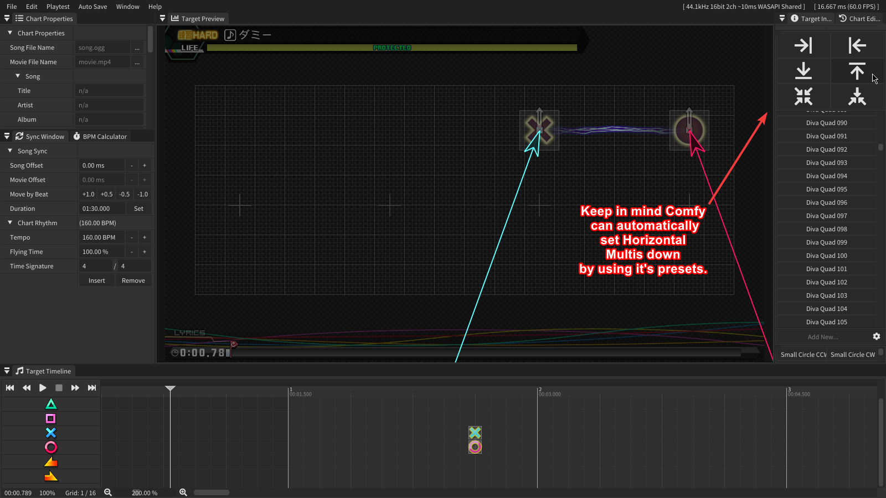
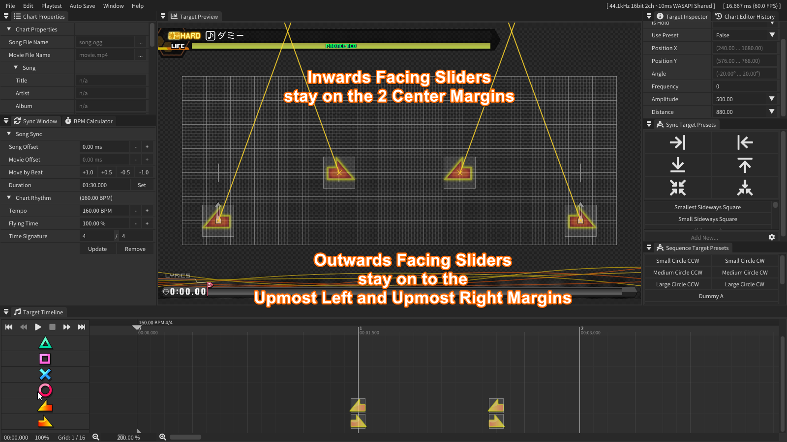
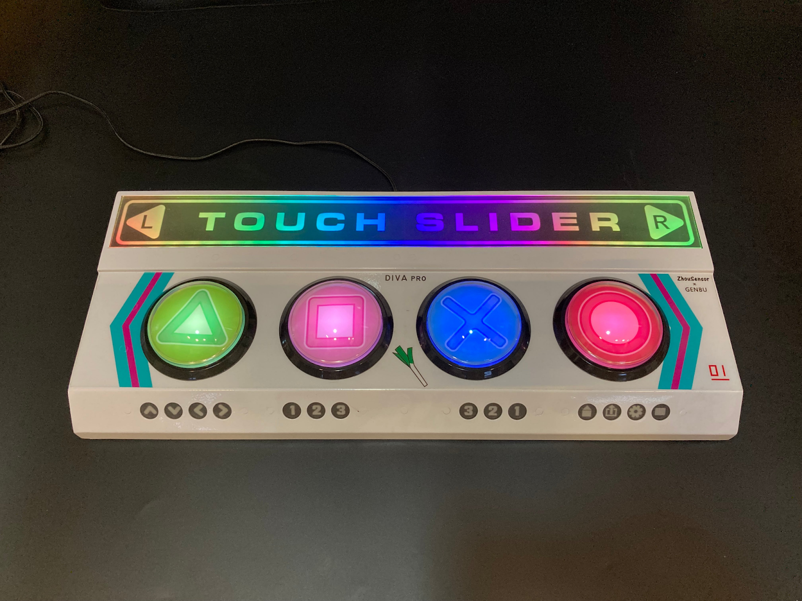
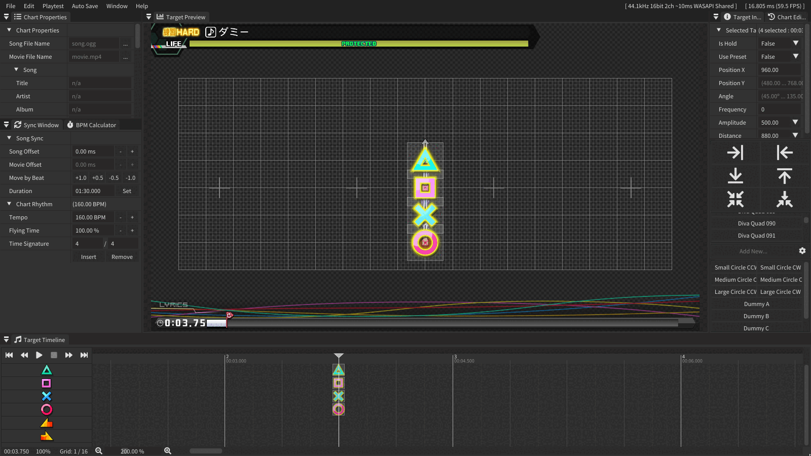

> [!NOTE]
> **Programs needed:**  
> - [Comfy Studio](https://discord.com/channels/531630856767406105/531640485459132416/921740942061486130&follow=true) (Only available on [Project DIVA 2nd Modding Discord Server](https://discord.gg/projectdiva&follow=true))  
> **You are expected to be familiar with the Comfy Studio program, or have at least read the User Manual provided within it.**

This tutorial does not go over syncing as most of it is a case-by-case scenario. If you have questions about your syncing, you can join the [Megamix+ Discord Server](https://discord.gg/yCgMZDg3&follow=true)/[Project DIVA 2nd Modding](https://discord.gg/projectdiva&follow=true) or contact me `@fujotaro` on discord.

## 1. Note Frequencies

Each Project DIVA Note has a set of attributes to change it's behavior in-game.  
Most of them are very straight forward and don't require much explaining. However, **`Frequency`** is the one you need to learn first if you are aiming to give a more polished appearance to your charts.   
SEGA has a very specific way of using this attribute since the Arcade Future Tone era of their charting and it's important you get familiar with this, but first, what even is this attribute?

Just like a sound wave, notes in DIVA follow an almost wave-like motion when travelling to their target. Altering this attribute will change the way notes will fly in.   
***Ex: Increasing the default value from 2/-2 to 3/4/5 will increase the Frequency of the waves until they reach the Target.***

You will be learning when to use a Positive Frequency (2) or a negative one (-2)   
Increasing or decreasing this value is not recommended if you plan on making SEGA-like charts, as their use in official charts is very scarce. 

Hold the <kbd>Right mouse button</kbd> on the timeline, similar to how you would use the rectangular selection tool in Windows and drag it over the notes to select them. Once the notes are selected, click anywhere with a left click on the Target Preview Window and press <kbd>2</kbd> on your keyboard to enter Angle Mode. You can rapidly switch Frequencies by pressing <kbd>R</kbd>.  
  
### 1.1 Note Frequencies Top (↑)  
When going Left to Right, the Frequencies should be as shown in these example images.  
  
### 1.1 Note Frequencies Top (↑)   
When going Right to Left, the Frequencies should be as shown in these example images.   
  
### 1.2 Note Frequencies Bottom (↓)   
When going Left to Right, the Frequencies should be as shown in these example images.   
     
### 1.2 Note Frequencies Bottom (↓)   
When going Right to Left, the Frequencies should be as shown in these example images.   
     
### 1.3 Spotting Wrong Note Frequencies   
After getting used to seeing Note Frequencies you will not need to use these example images and will automatically fix them whenever needed. But here's an example of some wrong frequencies (before SEGA gave attributes rules to improve readability.)   
     

## 2. Reaction Time   
When choosing the angles for our notes it's important to prioritize reaction time at all times. You want the player to be able to see the notes coming in smoothly to the target, especially in songs with faster BPM. Which is why when positioning next to the top or bottom margin, prioritize making sure the angles come from the opposite side of the margin you are on, this can however by bypassed for more complex patterns or those that are vertical.   
     

## 3. Horizontal Multis   
By looking at the Placement Grid you are able to spot Four + Signs, these are markers for all Multi Notes, made to assist Charters on where to position them horizontally. You are not allowed to move them left and right, only up and down. Each one of them corresponds to a different Note Type (:ac_t:, :ac_s:, :ac_x:, etc...)
For simplicity I have placed each note type above it’s corresponding Marker.   
     
*What does this all mean?*   
It means when placing down a Triangle + Square Multi Note horizontally, it will be placed on the First 2 Markers (starting from the Left).
     
It also means when placing down a  Cross + Circle Multi Note horizontally, it will be placed on the Last 2 Markers (starting from the Left)   
     
### 3.1 Multi Sliders   
Multi Sliders are very unique, they're the only form of Multis that can only be placed horizontally, SEGA has never made a Vertical Slider. Sliders are also a bit different when it comes to their placements, but simple to get down nonetheless. **Double-Left** Sliders stay on the **Left** Side of the screen, the **Right-Facing** Sliders stay on the **Right** side of the screen.    
     
For Multi Sliders not facing the same direction, Multi Sliders facing **Inwards should** be in the Two Markers closest to the **middle** of the screen.   
And for the Outwards facing Multi sliders they should be in the two markers closest to the edges of the screen.   
> [!IMPORTANT]
> **IMPORTANT**   
> Do keep in mind Comfy has some issues with Inwards and Outwards facing sliders since the program can't guess which one you want to put down.   
> To fix this, position the sliders in the markers corresponding to the Multi Slider you want, then use the preset feature so Comfy will do the rest.

     
### 3.2 Spotting Wrong Horizontal Positioning   
It's common for newer charters to not be aware that Horizontal Multis can't be moved left and right, in the following example image, I placed down a <kbd>:ac_t:+:ac_s:</kbd> multi in the wrong marker. It might seem insignificant to you as to why this rule exists but in my next point I will explain why it's this way.

## 4. Arcade Layout   
The Markers and each note type assigned to it are meant to represent the positioning of the notes in the actual Arcade Controller, SEGA made their charting directly "mirror" the controller to make it easier for newer players. If they see a Triangle+Square multi on the left they will automatically press the two buttons on the left in front of them.   

   
### 4.1 Arcade Order
While making a beatmap, it's very important you keep the hand movement of the player in mind. You don't want to make it uncomfortable for them to play it, it's not enjoyable. In my last point I brought up the Arcade Layout and how it's used to better the experience for Arcade players with Multi notes. However this also happens with Arcade Order. Just like Frequencies, Note Types in continuous stream of notes stopped being “random” and received some rules behind them post-AC Era. SEGA wanted sequences to feel natural and optimize good hand movement in their charts. 

Below you can find an image regarding the Arcade Order.   
   
I know that image must be a bit confusing to take in but just think of the hand movement whilst playing on an Arcade Controller. When you have a sequence going from left to right you want the player to hit notes comfortably.    
From left to right it goes: Triangle then Square then Cross then Circle   
From right to left it goes: Circle then Cross then Square then Triangle

As an example of this being used, when ur making a sequence that alternates between Square and Cross: Depending on which direction it's going to, the note types will have to swap.   
   
Here's another example where the notes aren't alternating every instance.   
   
While this is sometimes bypassed by SEGA in higher difficulties (exex n sometimes ex) it's important you understand why these rules exist before you start to bend them.

## 5. Vertical Multis

It's important to understand every multi in the game comes from a Vertical Quad note. Which means, if you delete some notes from a Quad note, you will obtain a Multi note that is correct. You are not allowed to move Multi notes away from each other vertically though (like separating the Square from the Cross, or moving certain notes from a multi closer, for example).   
   
   
### 5.1 Vertical Multi Notes in Sequences   
Whenever a Vertical Multi Note is present in a sequence, the angles for them should come from the direction the sequence is heading towards.
   
   
This can be bypassed depending on the complexity of the sequence at hand but do keep in mind you should focus on readability of your chart, you don't want to make it too cluttered visually.

### 5.1.1 Vertical Multi Notes in Sequences 

When you have multiple Multi notes in a sequence, think of every square in the grid as a different note type, you have to make them line up, remember, at base they're still all a quad note split into different variations. 

In this example image, you can see the Triangles from the multis are all lined up, think of the 2nd line as the line for the Square in multis, since it isn't used after the first multi, there's a gap for the rest of it, and so on and so on.
   
In the second image I made it a bit more complicated but it has the same system in mind.   

## 6. Sliders in Sequences
It's important to have the sliders in your sequences face the direction to which it is heading.   
